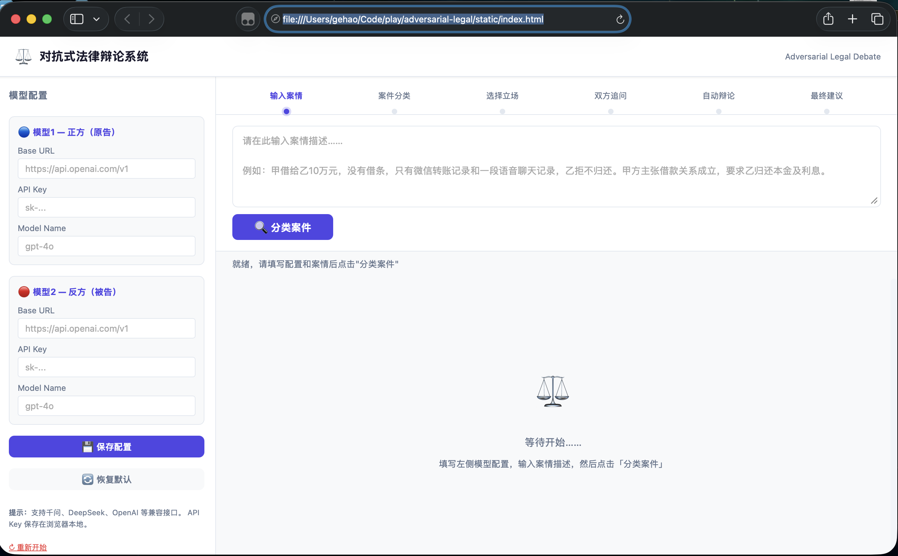

# ⚖️ 对抗式法律辩论系统

多阶段交互式法律咨询工具。两个 LLM 分别扮演原告律师和被告律师，在用户参与下完成案情梳理、交叉盘问、3 轮自动辩论，最终给出立场性法律建议。

## 项目名称

**对抗式生成法律模型**（Adversarial Generative Legal Model）。

## 为什么要做这个

大语言模型在设计上天然倾向于顺应叙述者的立场——你告诉它一个故事，它就顺着你的逻辑往下推演，帮你补全有利于你的论据。这种倾向并非模型的缺陷，而是一个更普遍的人类认知偏误在机器上的映射：丹尼尔·卡尼曼在《思考，快与慢》中描述的**乐观效应**——人们天然倾向于相信自己讲述的故事，高估有利因素、低估风险。

在法律咨询场景中，这种顺应性尤为危险。当事人带着自己的叙事来找模型，模型点头称是、有理有据地论证其胜算，实际上只是在回音壁里放大当事人的既有信念。当事人带着虚假的信心走进法庭，代价可能是数年诉讼和巨额费用。

本项目的核心思路是引入**正反对抗机制**：让两个 LLM 分别扮演原告律师和被告律师，针对同一案情进行交叉盘问和多轮辩论，中间有「法官」角色裁决。咨询者不再面对一个顺从的叙述者，而是旁观一场争辩——双方都会指出对方论证中的漏洞，最终给出更接近客观中立的法律建议。

## 交互流程

```
输入案情 → 案件分类 → 用户选择立场 → 双方律师追问 → 3轮自动辩论(SSE流) → 最终建议
```

1. **输入案情** — 用户描述案件事实
2. **案件分类** — 模型自动判定案件类型（合同纠纷/侵权/刑事等），识别当事人标签
3. **选择立场** — 用户选择自己是原告方还是被告方
4. **双方追问** — 己方律师友好了解情况 + 对方律师交叉盘问，用户逐一回答
5. **自动辩论** — 两模型 3 轮对抗，每轮：原告论证 → 被告论证 → 法官裁决（SSE 流式输出）
6. **最终建议** — 根据用户立场生成律师-委托人对话体建议，含胜算评估和行动方案

## 快速开始

### Docker（推荐）

```bash
cd adversarial-legal
docker compose up -d
```

浏览器打开 `http://localhost:8899` 即可使用。

### 本地运行

```bash
cd adversarial-legal
source ../.venv/bin/activate
pip install fastapi uvicorn openai httpx
python main.py
```

## 模型配置

支持所有 OpenAI 兼容接口（DeepSeek、千问、OpenAI 等）。

| 角色 | 说明 |
|------|------|
| 模型1 | 原告方（论证 + 向己方用户友好追问） |
| 模型2 | 被告方（论证 + 向对方用户交叉盘问） |
| 法官 | 每轮随机选择模型1或模型2 |
| 总结 | 随机选择模型1或模型2 |

配置保存在浏览器 localStorage，不会上传到服务器。

## 前端界面

单 HTML 页面，6 阶段向导式进度条。辩论阶段采用 **Tab 按钮导航**：

- 上方两排按钮（共 10 个），覆盖全部辩论轮次和最终建议
- 按钮初始禁用，内容通过 SSE 流式到达后自动激活并切换
- 点击任意已激活按钮即可回看对应内容
- 下方可滚动内容展示区

角色配色：🔵 蓝 = 原告 | 🔴 红 = 被告 | 🟡 金 = 法官 | 🟢 绿 = 总结



## 后端 API

| 端点 | 方法 | 说明 |
|------|------|------|
| `/api/classify` | POST | 分类案件类型，识别当事人 |
| `/api/generate-questions` | POST | 生成单方追问列表 |
| `/debate/start` | POST | 启动 3 轮辩论（SSE 流） |
| `/api/summary` | POST | 生成立场性最终建议 |

## 项目结构

```
adversarial-legal/
├── main.py              # FastAPI 应用，路由定义
├── graph.py             # 工作流编排，LLM 调用，SSE 生成器
├── prompts.py           # 全部 prompt 定义（分类/追问/论证/法官/总结）
└── static/
    └── index.html       # 单页前端
```

## 设计要点

- **追问与辩论分离**：追问在辩论前完成，辩论中只做论证和裁决
- **交叉可见性**：原告能看到被告上一轮论证，被告能看到原告同轮论证
- **防编造**：所有 prompt 强制要求只能引用案情报和用户回答中明确存在的信息
- **法官随机**：每轮随机选模，避免单一模型偏见
- **总结务实**：律师-委托人对话体，分形势判断、两条行动路径（继续打/调解）、明确结论，给出具体百分比和金额范围

## License

MIT
